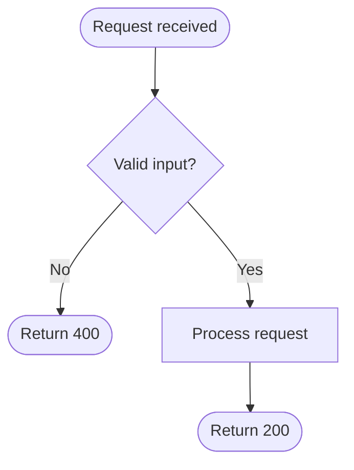
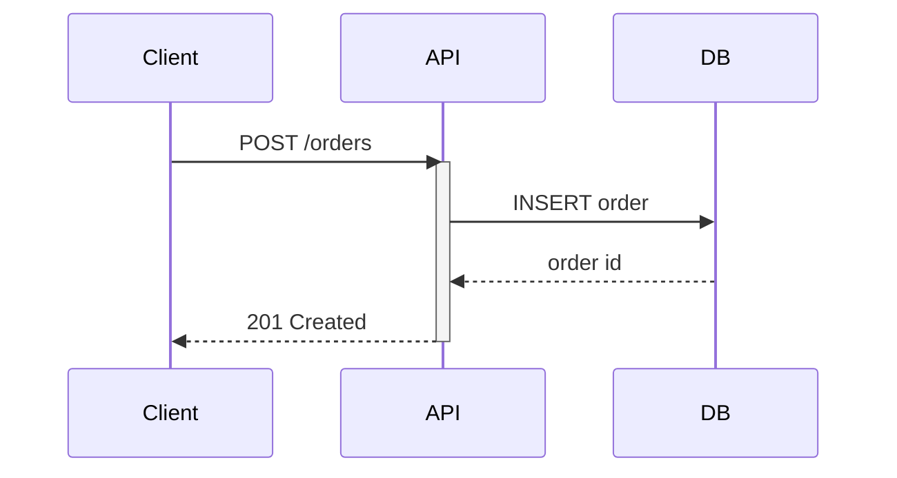
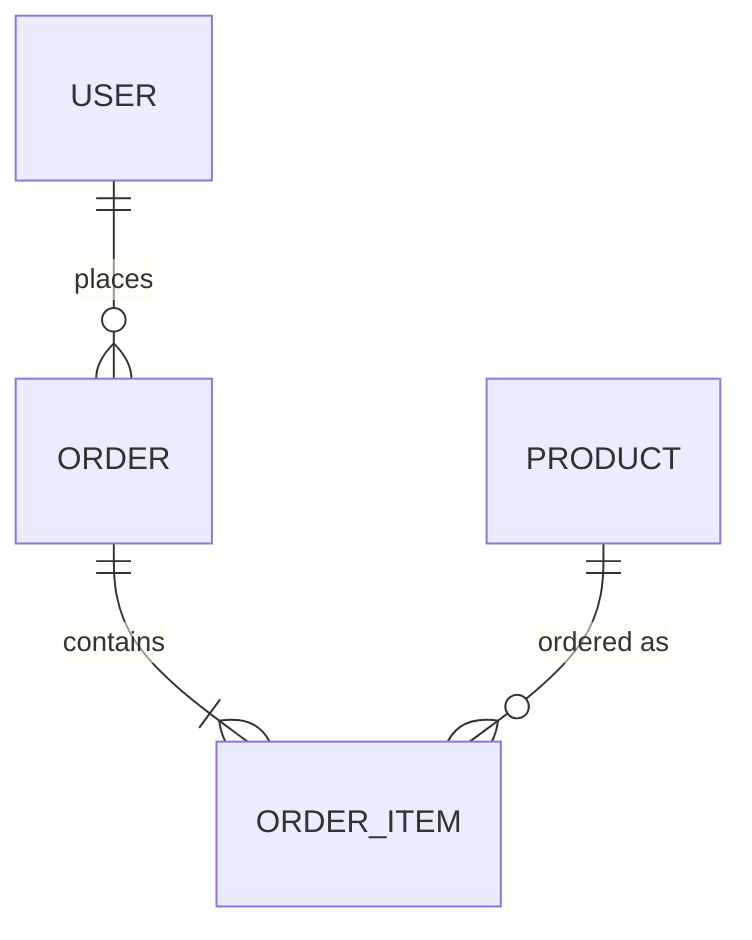
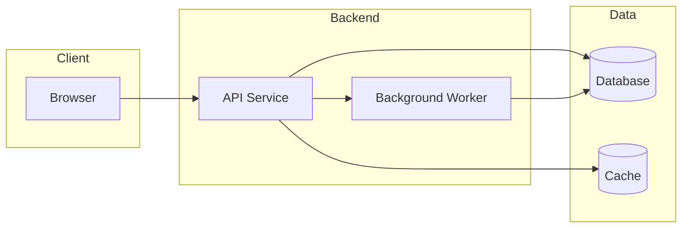
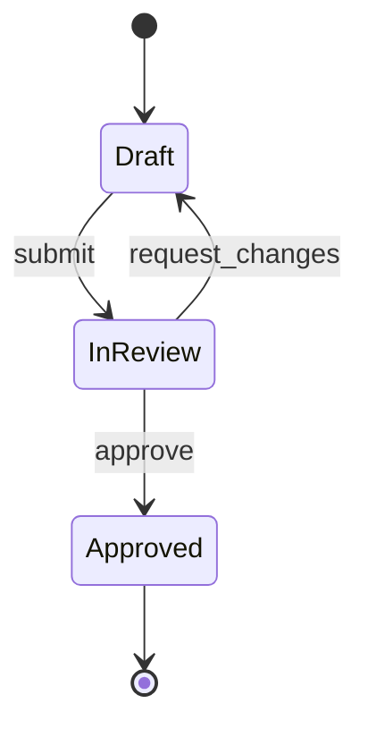

# Mermaid Diagram Patterns

Reference material for the `design-doc-diagramming` skill: which Mermaid diagram
type fits which kind of content, a minimal syntax skeleton for each, and the
accessibility rules that keep a diagram legible once it's out of the editor
that generated it.

## Picking the right diagram type

| Content shape | Diagram type | Mermaid keyword |
|---|---|---|
| A workflow, business process, or decision tree with branches | Activity / flowchart | `flowchart TD` / `flowchart LR` |
| Requests, calls, or messages between actors over time | Sequence | `sequenceDiagram` |
| Entities and their relationships (a schema) | Entity-relationship | `erDiagram` |
| Services, components, and how they depend on each other | Architecture (component graph) | `flowchart` with subgraphs, or `C4Context`/`C4Container` |
| Infrastructure — networks, zones, hosting boundaries | Deployment | `flowchart` with subgraphs per environment/zone |
| An object or request moving through discrete states | State machine | `stateDiagram-v2` |
| Class/type structure and inheritance | Class diagram | `classDiagram` |
| A timeline of work or milestones | Gantt | `gantt` |

Don't reach for a flowchart by default — a sequence diagram usually explains an
API interaction more clearly than a flowchart of the same calls, because it
carries the *ordering* for free.

## Skeletons

**Flowchart / activity** — decision points get diamond nodes, terminal states get rounded ones:



**Sequence** — actors first, then messages in order; use `activate`/`deactivate` to show lifetime:



**Entity-relationship** — cardinality goes between the entities, not in a label:



**Architecture / component graph** — group related nodes into `subgraph` blocks so the boundary itself is the point:



**State machine** — name the states as they'd appear in the code (an enum value, a status column), not as prose:



## Accessibility and legibility

- **Never encode meaning in color alone.** Pair any color-coded state with a label, shape, or icon so the diagram still reads in grayscale or for a colorblind viewer.
- **Check contrast in both themes.** A `classDef` with a pale fill and pale text disappears on a light background; verify against light and dark rendering, not just whichever theme you happen to be viewing in.
- **Keep node count low.** Past roughly 12–15 nodes a single diagram stops being a diagram and starts being an eye chart — split it into a top-level overview plus focused sub-diagrams for each area.
- **Label edges when the relationship isn't obvious from the shape alone** (`-->|"retries 3x"|`), but don't label the obvious ones — it's noise.

## Validating before you ship it

Read every generated diagram back as if you'd never seen the source: does the
shape match the described flow, or did a copy-paste leave a stale label? If
`mermaid-cli` (`mmdc`) is available in the project, validate syntax with it
before embedding the diagram in a document:

```bash
npx -y @mermaid-js/mermaid-cli -i diagram.mmd -o /dev/null
```

A non-zero exit means a syntax error — fix it before embedding, since a broken
fence renders as a wall of raw text in any Markdown viewer that doesn't
support Mermaid.
