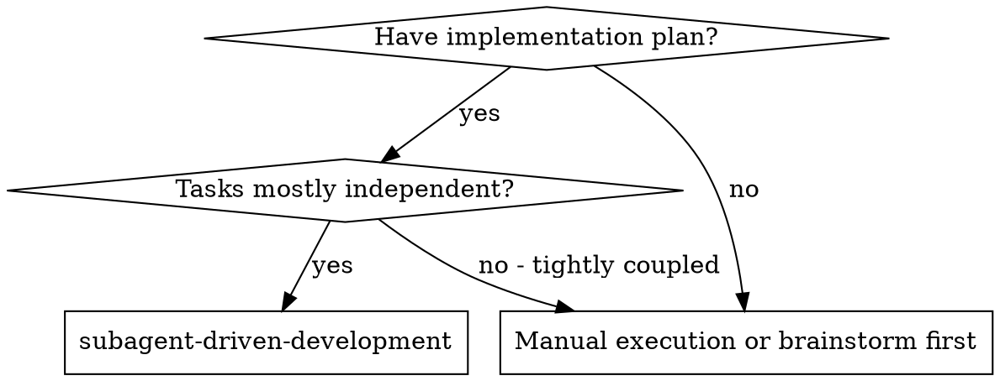
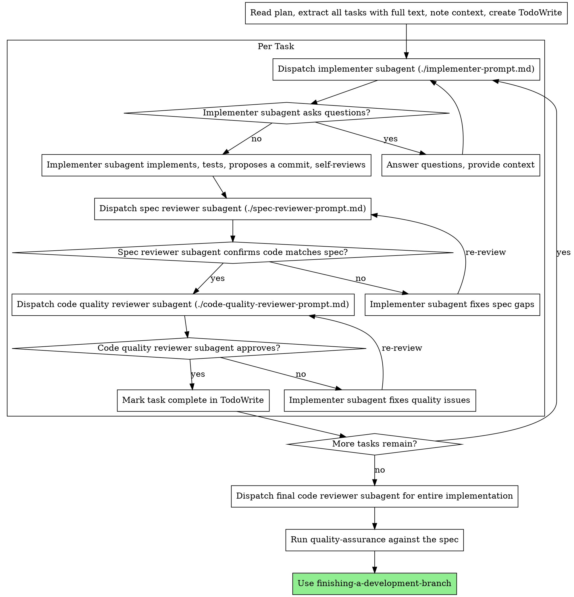

# Subagent-Driven Development

Execute plan by dispatching fresh subagent per task, with two-stage review after each: spec compliance review first, then code quality review.

**Core principle:** Fresh subagent per task + two-stage review (spec then quality) = high quality, fast iteration

## When to Use


**vs. manual, in-session execution:**
- Fresh subagent per task (no context pollution)
- Two-stage review after each task: spec compliance first, then code quality
- Faster iteration (no human-in-loop between tasks)

## Before You Start: Branch Setup

Before dispatching any subagent, use the `AskUserQuestion` tool to confirm branch setup — never create a branch silently, even when the answer seems obvious.

1. Check whether `dev` exists (locally or on the remote). If it does, fetch and pull it to make sure it's current *before* branching from it — a feature branch cut from a stale local `dev` silently misses whatever's landed since.
2. Ask via `AskUserQuestion`:
   - If `dev` exists: propose creating a feature branch from `dev` (pulled to latest) — confirm before creating it, don't assume yes.
   - If `dev` doesn't exist: say so explicitly in the same ask ("`dev` branch not found") and ask which branch to use instead, rather than guessing `main` or any other default.
3. Create the feature branch only after that confirmation comes back, then proceed to the process below.

**Never run `git commit` when the work is done** — draft commit messages and propose them at every point this skill calls for a commit (implementer's own proposed commit, and `finishing-a-development-branch` at the end); leave the actual commit to the user unless they've explicitly asked you to commit in that session.

## The Process



**Running `quality-assurance` after the final code review is a mandatory action, not a box to mentally check off afterward — and it must be genuinely live: a real server, real database, real authenticated user, not mocked tests or a suite merely named "e2e."** In practice, agents following this skill have gone straight from "final reviewer approved" to declaring the implementation done, and only run `quality-assurance` when the user notices and asks for it — and even then, have substituted mocked/unit-level tests for live verification without saying so. Don't let either be the trigger — invoke it live yourself, unprompted, as the actual next step once the final code review passes. If full live verification is tedious to set up, `quality-assurance`'s own graduated fallback applies (a lighter live check via curl/CLI or an automated test against the real dev server, offered via `AskUserQuestion`) — never downgrade straight to mocks on your own.

## Prompt Templates

- `./implementer-prompt.md` - Dispatch implementer subagent
- `./spec-reviewer-prompt.md` - Dispatch spec compliance reviewer subagent
- `./code-quality-reviewer-prompt.md` - Dispatch code quality reviewer subagent

## Example Workflow

```
You: I'm using Subagent-Driven Development to execute this plan.

[Read plan file once: plans/feature-plan.md, from the project's external output location]
[Extract all 5 tasks with full text and context]
[Create TodoWrite with all tasks]

Task 1: Hook installation script

[Get Task 1 text and context (already extracted)]
[Dispatch implementation subagent with full task text + context]

Implementer: "Before I begin - should the hook be installed at user or system level?"

You: "User level (~/.config/superpowers/hooks/)"

Implementer: "Got it. Implementing now..."
[Later] Implementer:
  - Implemented install-hook command
  - Added tests, 5/5 passing
  - Self-review: Found I missed --force flag, added it
  - Staged, drafted a commit message (left for you to commit)

[Dispatch spec compliance reviewer]
Spec reviewer: ✅ Spec compliant - all requirements met, nothing extra

[Get git SHAs, dispatch code quality reviewer]
Code reviewer: Strengths: Good test coverage, clean. Issues: None. Approved.

[Mark Task 1 complete]

Task 2: Recovery modes

[Get Task 2 text and context (already extracted)]
[Dispatch implementation subagent with full task text + context]

Implementer: [No questions, proceeds]
Implementer:
  - Added verify/repair modes
  - 8/8 tests passing
  - Self-review: All good
  - Staged, drafted a commit message (left for you to commit)

[Dispatch spec compliance reviewer]
Spec reviewer: ❌ Issues:
  - Missing: Progress reporting (spec says "report every 100 items")
  - Extra: Added --json flag (not requested)

[Implementer fixes issues]
Implementer: Removed --json flag, added progress reporting

[Spec reviewer reviews again]
Spec reviewer: ✅ Spec compliant now

[Dispatch code quality reviewer]
Code reviewer: Strengths: Solid. Issues (Important): Magic number (100)

[Implementer fixes]
Implementer: Extracted PROGRESS_INTERVAL constant

[Code reviewer reviews again]
Code reviewer: ✅ Approved

[Mark Task 2 complete]

...

[After all tasks]
[Dispatch final code-reviewer]
Final reviewer: All requirements met, ready to merge

[Run quality-assurance against the spec]
QA: Executed scenarios against the spec — PASS, evidence attached

Done!
```

## Advantages

**vs. Manual execution:**
- Subagents follow TDD naturally
- Fresh context per task (no confusion)
- Parallel-safe (subagents don't interfere)
- Subagent can ask questions (before AND during work)

**Efficiency gains:**
- No file reading overhead (controller provides full text)
- Controller curates exactly what context is needed
- Subagent gets complete information upfront
- Questions surfaced before work begins (not after)

**Quality gates:**
- Self-review catches issues before handoff
- Two-stage review: spec compliance, then code quality
- Review loops ensure fixes actually work
- Spec compliance prevents over/under-building
- Code quality ensures implementation is well-built
- `quality-assurance` after the final code review confirms the whole implementation actually works end-to-end, against the spec — the per-task reviews check the code itself, not live behavior; neither replaces the other
- Code quality review confirms each task's tests actually cover its core logic (a real assertion on expected behavior, not just "didn't throw") — a test that only proves the code ran isn't what catches a future regression
- Code quality review also confirms that coverage spans every scenario type that genuinely applies — happy path, edge cases, error handling, fix/regression confirmation — not just whichever one the implementer subagent found fastest to write

**Cost:**
- More subagent invocations (implementer + 2 reviewers per task)
- Controller does more prep work (extracting all tasks upfront)
- Review loops add iterations
- But catches issues early (cheaper than debugging later)

## Red Flags

**Never:**
- Skip reviews (spec compliance OR code quality)
- Proceed with unfixed issues
- Dispatch multiple implementation subagents in parallel (conflicts)
- Make subagent read plan file (provide full text instead)
- Skip scene-setting context (subagent needs to understand where task fits)
- Ignore subagent questions (answer before letting them proceed)
- Accept "close enough" on spec compliance (spec reviewer found issues = not done)
- Skip review loops (reviewer found issues = implementer fixes = review again)
- Let implementer self-review replace actual review (both are needed)
- **Start code quality review before spec compliance is ✅** (wrong order)
- Move to next task while either review has open issues
- Call the implementation done after the final code review without running `quality-assurance` — code review confirms the code is well-built, not that it works live against the spec
- `quality-assurance` run against mocks or a suite merely named "e2e", reported as if it were genuinely live verification
- Dispatch the first implementer subagent before branch setup was confirmed via `AskUserQuestion`
- Branch from a local `dev` without pulling it to latest first
- `dev` missing and a fallback branch picked silently instead of asked about
- Approving a task's tests when they only cover one scenario type (e.g. only error/rejection handling) and happy path, edge cases, or fix confirmation genuinely applied too
- Marking a task complete when the implementer reported tests passing but never ran (or never reported) this project's build and lint commands

**If subagent asks questions:**
- Answer clearly and completely
- Provide additional context if needed
- Don't rush them into implementation

**If reviewer finds issues:**
- Implementer (same subagent) fixes them
- Reviewer reviews again
- Repeat until approved
- Don't skip the re-review

**If subagent fails task:**
- Dispatch fix subagent with specific instructions
- Don't try to fix manually (context pollution)

## Integration

**Required workflow skills:**
- **planning-and-task-breakdown** - Creates the plan this skill executes
- **requesting-code-review** - Code review template for reviewer subagents
- **quality-assurance** - Live/end-to-end verification against the spec, after the final code review and before finishing the branch
- **finishing-a-development-branch** - Complete development after all tasks

**Subagents should use:**
- **test-driven-development** - Subagents follow TDD for each task

## See Also

- `quality-assurance` — the live/end-to-end check after the final code review; code review and QA verify different things, neither replaces the other
- `references/coding-patterns.md` — structural patterns each dispatched subagent should apply to its task's implementation
- `review-findings.md` at the project's external output location (see `references/external-output-paths.md`) — worth including in each subagent's task brief, if it exists, so previously-flagged patterns don't get repeated by a fresh subagent with no memory of past reviews

## Limitations
- Use this skill only when the task clearly matches the scope described above.
- Do not treat the output as a substitute for environment-specific validation, testing, or expert review.
- Stop and ask for clarification if required inputs, permissions, safety boundaries, or success criteria are missing.
