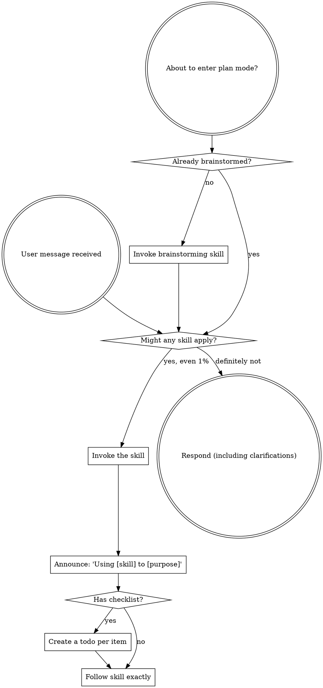

---
name: using-agent-harness
type: meta
description: Intent router and pre-flight checker for agent-harness — checks for a matching skill before any response, then maps what the user describes to the right agent persona and skill. Use when starting any task to determine which agent and skill should handle it.
---

# Using Agent Harness

This meta-skill is both a **pre-flight checker** and an intent router. It enforces skill usage before any response, then routes the user's intent to the correct agent persona and skill scope.

## Instruction Priority

User instructions always take precedence:

1. **User's explicit instructions** (CLAUDE.md, GEMINI.md, AGENTS.md, direct requests) — highest priority
2. **This skill** — overrides default system behavior where they conflict
3. **Default system prompt** — lowest priority

## Pre-Flight Rule (Mandatory)

**Before responding to anything — including clarifying questions — invoke the relevant skill first.**

If there is even a 1% chance a skill is relevant, **YOU ABSOLUTELY MUST invoke it.** This is not negotiable. This is not optional. You cannot rationalize your way out of this.



## Red Flags

These thoughts mean STOP — you are rationalising. Invoke the skill instead.

| Thought | Reality |
|---|---|
| "This is just a simple question" | Questions are tasks. Check for skills. |
| "I need more context first" | Skill check comes BEFORE clarifying questions. |
| "Let me explore the codebase first" | Skills tell you HOW to explore. Check first. |
| "I can check git/files quickly" | Files lack conversation context. Check for skills. |
| "Let me gather information first" | Skills tell you HOW to gather information. |
| "This doesn't need a formal skill" | If a skill exists, use it. |
| "I remember this skill" | Skills evolve. Read current version. |
| "This doesn't count as a task" | Action = task. Check for skills. |
| "The skill is overkill" | Simple things become complex. Use it. |
| "I'll just do this one thing first" | Check BEFORE doing anything. |
| "I need more context before routing" | Routing comes before gathering context. |
| "Let me just quickly fix this" | Quick fixes without process create new bugs. |
| "This doesn't match any skill exactly" | 1% match is enough. Invoke and adapt. |
| "I already know what to do" | Knowing the answer ≠ skipping the workflow. |

## Skill Priority

When multiple skills could apply, use this order:

1. **Process skills first** (brainstorming, systematic-debugging) — these determine HOW to approach the task
2. **Implementation skills second** (frontend-design, mcp-builder) — these guide execution

"Let's build X" → brainstorming first, then implementation skills.
"Fix this bug" → systematic-debugging first, then domain-specific skills.

## Skill Types

**Rigid** (TDD, systematic-debugging): Follow exactly. Don't adapt away the discipline.

**Flexible** (patterns): Adapt principles to context.

The skill itself tells you which type it is.

## User Instructions

Instructions say WHAT, not HOW. "Add X" or "Fix Y" doesn't mean skip workflows.

## Post-Implementation Gate (Mandatory)

**After any file edit — before claiming the task is done — verification is required.**

This gate is as non-negotiable as the Pre-Flight Rule. Skipping it is the exact failure mode this harness was built to prevent.

```
Files edited (Write / Edit / NotebookEdit called)
        ↓
UI / auth / functional change?
        ↓ yes                          ↓ no
Run /verify                     Run the relevant test / build command
Open app in browser             Show actual command output
Confirm:                              ↓
  • No console errors           State actual result with evidence
  • No Failed to fetch              ↓
  • Forms submit correctly      Claim completion
  • No regressions
        ↓
Claim completion
```

**Completion phrases that are BLOCKED without prior /verify:**

| Blocked phrase | Required action |
|---|---|
| "It should work now" | Run /verify — show browser output |
| "I believe the fix is in" | Run /verify — confirm no console errors |
| "This looks correct" | Run the test — show 0 failures |
| "The change is simple so…" | Simple changes break things. Run /verify. |
| "I can't run the browser" | Say so explicitly — NEVER claim it works |

**What /verify means for UI tasks:**
- Open the affected page in a browser
- Check browser console (zero errors, zero Failed to fetch)
- Exercise the changed flow (form submit, tab switch, auth redirect, etc.)
- Scroll to check no layout regressions

---

## Two Entry Paths (Both Supported)

**Path 1 — Slash commands (explicit, backwards-compatible):**
Users can always invoke a command directly. Commands route straight to their skill — no agent lookup needed.

| Command | Invokes | Purpose |
|---------|---------|---------|
| `/spec` | `spec-driven-development` | Write a structured spec before coding |
| `/plan` | `planning-and-task-breakdown` | Break work into tasks with acceptance criteria |
| `/build` | `incremental-implementation` + `test-driven-development` | Implement the next task (or whole plan with `auto`) |
| `/test` | `test-driven-development` | TDD loop — red, green, refactor |
| `/review` | `code-review-and-quality` | Five-axis code review before merge |
| `/ship` | `shipping-and-launch` | Fan-out to code-reviewer + security-auditor + test-engineer |
| `/webperf` | `performance-optimization` | Web performance audit via web-performance-auditor |
| `/code-simplify` | `code-simplification` | Simplify without changing behavior |

Commands are always valid. When a user types one, follow it directly — skip the intent routing below.

---

**Path 2 — Intent routing (natural language):**
When a user describes what they want to build, fix, or review — without using a slash command — match their words against the keyword table below to determine:

1. **Which agent to invoke** (the *who*)
2. **Which skill to start with** (the *how*)
3. **Which command applies** (the *when*)

## Intent → Agent → Skill Routing Table

### API & Integration Work
**Trigger words:** API, endpoint, REST, GraphQL, OpenAPI, Swagger, versioning, rate limiting, JWT, OAuth, pagination, contract, webhook, idempotent, CRUD, HTTP, request/response

→ **Agent:** `api-developer`
→ **Start with skill:** `api-and-interface-design` or `spec-driven-development`
→ **Command:** `/spec` then `/build`

---

### Database & Data Storage
**Trigger words:** database, schema, table, migration, SQL, query, index, PostgreSQL, MySQL, MongoDB, Redis, ORM, Prisma, Drizzle, normalization, foreign key, join, slow query, NoSQL

→ **Agent:** `db-architect`
→ **Start with skill:** `database-design` or `database-migration`
→ **Command:** `/spec` then `/build`

---

### Infrastructure, CI/CD & Deployment
**Trigger words:** Docker, Kubernetes, Terraform, CI/CD, pipeline, deploy, container, GitHub Actions, GitOps, Helm, secrets, environment variables, infrastructure, IaC, Ansible, SLO, incident, monitoring, alerting

→ **Agent:** `senior-devops`
→ **Start with skill:** `ci-cd-and-automation` or `docker-expert`
→ **Command:** `/build` or `/ship`

---

### Frontend & UI
**Trigger words:** component, React, Next.js, Vue, Tailwind, CSS, HTML, UI, UX, accessibility, WCAG, keyboard navigation, state management, Zustand, Redux, re-render, bundle, design system, dark mode, responsive, animation

→ **Agent:** `senior-frontend-engineer`
→ **Start with skill:** `frontend-ui-engineering` or `react-best-practices`
→ **Command:** `/spec` then `/build`

---

### Cloud Architecture
**Trigger words:** cloud, AWS, Azure, GCP, multi-region, disaster recovery, high availability, IAM, cost optimization, serverless, Lambda, Cloud Run, CloudFormation, auto-scaling, Well-Architected, CDN, VPC, vendor lock-in

→ **Agent:** `senior-cloud-architect`
→ **Start with skill:** `cloud-architect` or `documentation-and-adrs`
→ **Command:** `/spec` or `/build`

---

### Backend Services & APIs
**Trigger words:** backend, service, microservice, async, message queue, Kafka, RabbitMQ, cache, Redis, gRPC, Go, Golang, Node.js, Python, FastAPI, Django, circuit breaker, background job, event sourcing, CQRS, worker

→ **Agent:** `senior-backend-engineer`
→ **Start with skill:** `backend-architect` or `api-and-interface-design`
→ **Command:** `/spec` then `/build`

---

### AI / ML Features
**Trigger words:** AI, LLM, GPT, Claude, Anthropic, prompt, RAG, vector, embedding, fine-tuning, agent, LangChain, LangGraph, evaluation, hallucination, guardrail, tool use, function calling, AI safety, semantic search, chatbot

→ **Agent:** `ai-ml-engineer`
→ **Start with skill:** `spec-driven-development` or `llm-app-patterns`
→ **Command:** `/spec` then `/build`

---

### Code Review & Quality
**Trigger words:** review, check my code, is this good, feedback on, before merge, pull request, PR, clean up, refactor, simplify, code smell, technical debt

→ **Agent:** `code-reviewer`
→ **Start with skill:** `code-review-and-quality`
→ **Command:** `/review`

---

### Security
**Trigger words:** security, vulnerability, audit, hack, inject, XSS, SQL injection, CSRF, auth bypass, secure, harden, OWASP, CVE, token, password, encryption, sensitive data

→ **Agent:** `security-auditor`
→ **Start with skill:** `security-and-hardening`
→ **Command:** `/review` or `/ship`

---

### Testing
**Trigger words:** test, spec, coverage, failing test, bug proof, unit test, integration test, E2E, Cypress, Playwright, Jest, pytest, mock, stub, test suite

→ **Agent:** `test-engineer`
→ **Start with skill:** `test-driven-development`
→ **Command:** `/test`

---

### Web Performance
**Trigger words:** slow, performance, LCP, INP, CLS, Core Web Vitals, Lighthouse, bundle size, lazy load, preload, render blocking, TTFB, speed

→ **Agent:** `web-performance-auditor`
→ **Start with skill:** `performance-optimization`
→ **Command:** `/webperf`

---

### QA Verification
**Trigger words:** verify, QA, does this work, check if it works, make sure nothing is broken, confirm the fix, regression check, validate the feature, working as expected, smoke test, sanity check, verify all the fixes are in place, is this working, confirm this is fixed

→ **Agent:** `senior-qa-engineer`
→ **Start with skill:** `quality-assurance`
→ **Command:** `/test` or direct invocation

---

## Cross-Cutting Skills (No Agent — Invoke Directly)

These skills fire regardless of domain. They cover situations that happen across every project and are not tied to a specific engineering area. **Check these before routing to a domain agent** — they often apply first.

### Receiving Code Review Feedback
**Trigger words:** someone reviewed my code, here are review comments, my PR has comments, reviewer said, feedback on my PR, address these comments, code review feedback, reviewer flagged

→ **Skill:** `receiving-code-review`
→ No agent. Invoke directly. Evaluate each comment technically before implementing.

---

### Requesting a Code Review
**Trigger words:** request a review, ready for review, submit for review, ask for feedback, PR is ready, want someone to review

→ **Skill:** `requesting-code-review`
→ No agent. Invoke directly before opening a PR or asking for a review.

---

### Finishing a Development Branch
**Trigger words:** I'm done, implementation complete, finished the feature, ready to merge, done with the branch, all tests pass, wrap this up, close this out

→ **Skill:** `finishing-a-development-branch`
→ No agent. Invoke directly when work is complete and the path forward (merge, PR, cleanup) needs to be decided.

---

### Systematic Debugging
**Trigger words:** bug, broken, not working, unexpected behaviour, crash, error, failing, something is wrong, why is this happening, root cause, trace this

→ **Skill:** `systematic-debugging`
→ No agent. Invoke directly before proposing any fix. Root cause first, patch second.

---

### Verification Before Completion
**Trigger words:** it works, I think it's done, looks good, should be fixed, seems to work, I believe this is correct, that should do it, done

→ **Skill:** `verification-before-completion`
→ No agent. Invoke whenever a completion or success claim is about to be made. Evidence before claims.

---

### Writing a Plan
**Trigger words:** plan this, how should I approach, break this down, map this out, before I start, let me plan, write a plan for

→ **Skill:** `writing-plans`
→ No agent. Invoke before touching code on any multi-step task.

---

### Executing a Plan
**Trigger words:** execute the plan, follow the plan, implement the plan, carry out the steps, run through the plan, start the plan

→ **Skill:** `executing-plans`
→ No agent. Invoke when a written plan exists and execution is starting.

---

### Brainstorming
**Trigger words:** brainstorm, ideas for, what are the options, how could we, what should I build, explore approaches, what are the possibilities, think through

→ **Skill:** `brainstorming`
→ No agent. Invoke before any creative or architectural decision. Options before commitment.

---

## Lifecycle Commands

When the user describes a full feature (not just one concern), follow the lifecycle:

| Phase | Command | Agent(s) | Skills |
|-------|---------|----------|--------|
| Define | `/spec` | domain agent | `spec-driven-development` |
| Plan | `/plan` | domain agent | `planning-and-task-breakdown` |
| Build | `/build` | domain agent | `incremental-implementation` + `test-driven-development` |
| Verify | `/test` | `test-engineer` | `test-driven-development` |
| Review | `/review` | `code-reviewer` | `code-review-and-quality` |
| Ship | `/ship` | `code-reviewer` + `security-auditor` + `test-engineer` | `shipping-and-launch` |

## Routing Decision Process

1. **Read the user's message** — extract the domain nouns and action verbs
2. **Match against the keyword table** — find the strongest signal category
3. **Check for multiple concerns** — if the task spans multiple domains (e.g. "build a secure API with a database"), route to the primary domain agent first; surface secondary concerns in their skill invocations
4. **State the route** — tell the user which agent and skill you're invoking and why
5. **Invoke the agent/skill** — do not implement without first routing

## Multiple Domain Signals

When a request spans multiple domains, apply this priority order:
1. Security concerns → always surface to `security-auditor`
2. Primary build domain → route to domain agent
3. Testing → `test-engineer` at the end
4. Review → `code-reviewer` before ship

**Example:** "Build a user registration endpoint with password hashing and email verification"
- Primary: `api-developer` (endpoint)
- Secondary: `security-auditor` (password hashing)
- Lifecycle: `/spec` → `/build` → `/test` → `/ship`

## Anti-Patterns

Do not:
- Implement without routing first
- Skip the domain agent for "simple" tasks
- Route everything to `code-reviewer` — that is for review, not build
- Invoke multiple agents sequentially yourself — use `/ship` for fan-out

## Relationship to Other Skills

This skill is the **entry point**. After routing, hand off to the domain agent which then uses its `## When to Invoke Skills` table to pull the right skill from its scope.

```
User intent → using-agent-harness (this skill) → Agent persona → Skill
```
